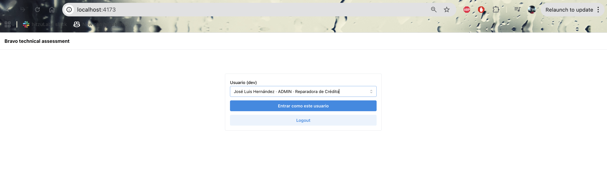
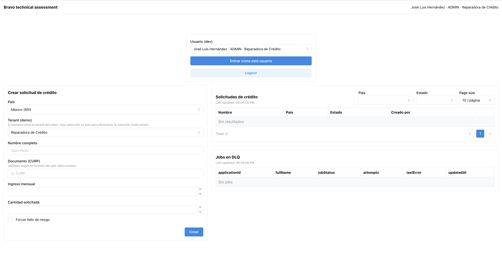
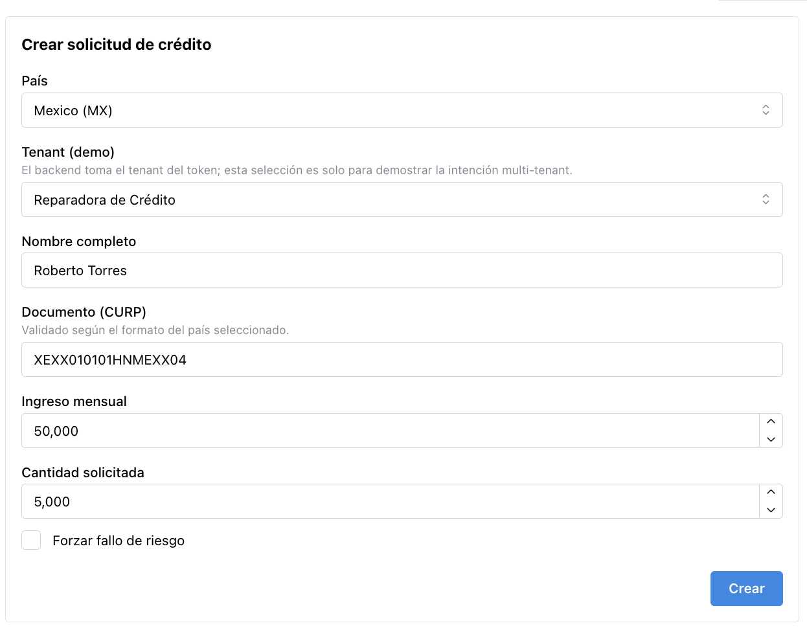
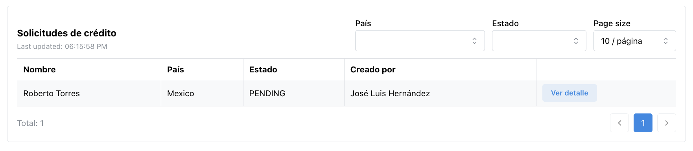
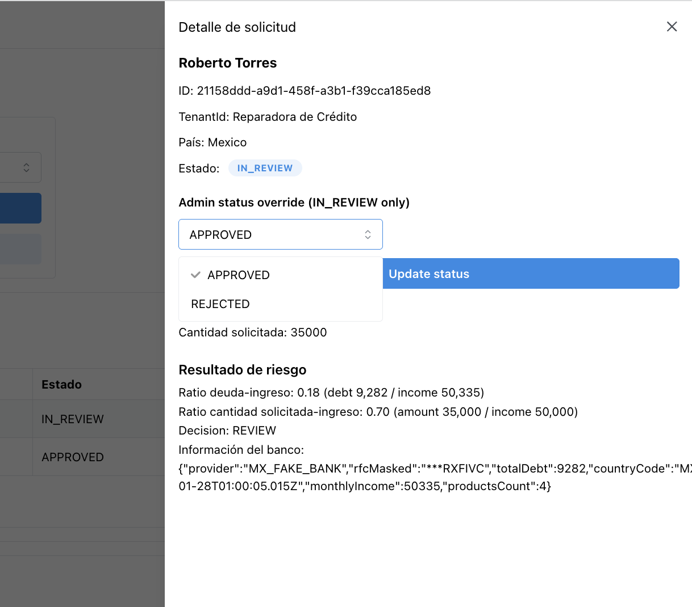
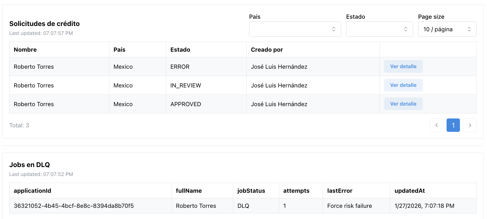
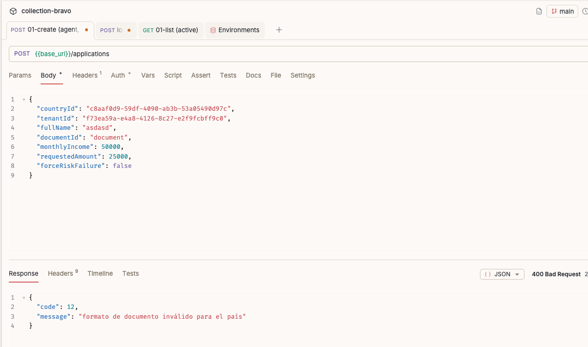
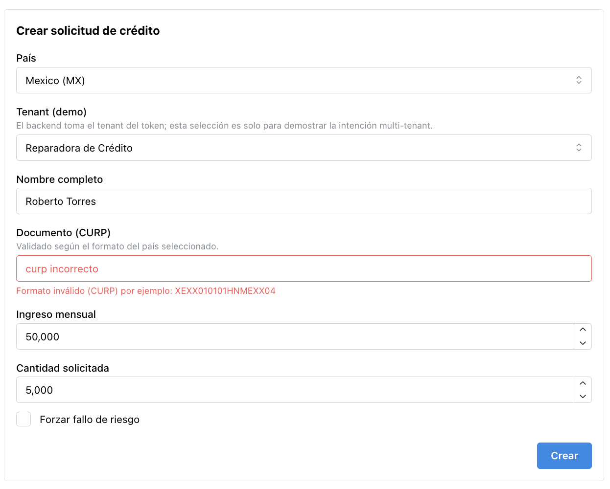

# Bravo – Technical Assessment

Sistema de evaluación de solicitudes de crédito **multi-tenant**, con:

- Backend en **NestJS + TypeORM + PostgreSQL**
- Frontend en **React + Vite + Mantine**
- Multi-tenant + RBAC (roles `ADMIN` / `AGENT`)
- Procesamiento asíncrono con cola en Postgres (`async_jobs`) y worker
- Motor de riesgo por país con estrategia pluggable (Strategy Pattern)
- Cache in-memory detrás de una interfaz (`CachePort`) para poder cambiar a Redis sin tocar la lógica de negocio
- Webhooks mock para simular la recepción de eventos de un proveedor externo

> **Short English summary (for non-Spanish reviewers)**
>
> This repo implements a multi-tenant credit application system using NestJS + Postgres (with a DB-backed job queue), a country-specific risk engine, in-memory cache behind a port (ready for Redis), and a small React + Vite UI to demonstrate RBAC (ADMIN/AGENT), async processing, DLQ and a mock external webhook.

El objetivo es mostrar cómo diseñaría e implementaría un sistema de este tipo en el contexto de una prueba técnica, priorizando **claridad, trazabilidad y extensibilidad**.

---

## 1. Stack

### Backend

- Node.js 22
- NestJS 11
- TypeORM + PostgreSQL
- Jest (unit tests)
- nestjs-pino para logging estructurado

### Frontend

- React 19
- Vite
- Mantine UI
- Axios

### 1.1. Documentación (para el revisor)

Si tienes poco tiempo, te recomiendo este orden:

1. `docs/technical_decisions.md` → visión general y decisiones clave.
2. `docs/data_model.ts` → modelo de datos y relaciones principales.
3. `README.md` (esta página) → cómo ejecutar la demo paso a paso.

Documentos disponibles:

- [`docs/technical_assessment.md`](docs/technical_assessment.md): enunciado oficial de la prueba.
- [`docs/data_model.md`](docs/data_model.md): modelo de datos (ER + explicación tabla por tabla).
- [`docs/technical_decisions.md`](docs/technical_decisions.md): decisiones técnicas y tradeoffs.
- [`docs/future_work.md`](docs/future_work.md): escalabilidad, grandes volúmenes e ideas de trabajo futuro.
- [`docs/design_doc.md`](docs/design_doc.md): diseño detallado y archivo base que guió el desarrollo del MVP (más largo; útil si se quiere profundizar).

Documentación adicionales

- [`docs/ci_cd.md`](docs/ci_cd.md): pre-hooks locales con Husky y pipeline de CI/CD en GitHub Actions.
- [`docs/kubernetes.md`](docs/kubernetes.md): guía de despliegue en Kubernetes usando los artefactos generados por CI.

---

## 2. Cómo correr el proyecto en local

### 2.1. Pre-requisitos

- Docker + Docker Compose instalados y funcionando.

No necesitas instalar Node ni Postgres localmente si usas el modo demo dockerizado.

### 2.2. Demo (Dockerizado)

En la raíz del repo:

```bash
docker compose -f docker-compose.demo.yml up --build
```

Esto levanta:

- Backend (NestJS + Swagger) en: <http://localhost:3000>
- Documentación Swagger en: <http://localhost:3000/api>
- Frontend (build de Vite) en: <http://localhost:4173>

Para bajar todo (incluyendo volumen de Postgres):

```bash
docker compose -f docker-compose.demo.yml down -v
```

---

## 3. Customer journey (recorrido sugerido)

El objetivo de esta sección es que puedas ver **todas las piezas clave** (multi-tenant, RBAC, jobs async, DLQ, webhook) en unos pocos minutos.

### 3.1. Pantalla inicial

Abre el frontend:

> <http://localhost:4173>

Deberías ver una pantalla similar a:



Para facilitar las pruebas, usando seeds se generan **dos tenants** que representan dos productos de Bravo:

- **Reparadora de crédito**
- **Préstamos**

Y a cada tenant se le asignan dos usuarios:

- **Administrador** (rol `ADMIN`)
- **Agente** (rol `AGENT`)

En esta pantalla inicial:

1. Elige cualquier usuario de la lista (la UI ya trae el `tenant`, `userId` y `role` listos).
2. Haz clic en **“Entrar como este usuario”**.
3. El frontend llamará al backend (`/auth/login`) y guardará el token dev en `localStorage`.

Con un usuario autenticado, se mostrará el **panel de administración**.

---

### 3.2. Panel de administración

Al entrar como usuario verás:

- Formulario para crear **solicitudes de crédito**.
- Tabla de solicitudes del tenant (RBAC aplicado).
- Tabla de **jobs en DLQ** (solo si hay fallos).

Ejemplo:



RBAC aplicado en el listado:

- `ADMIN` → ve **todas** las solicitudes de su tenant y puede actualizar el status.
- `AGENT` → solo ve las solicitudes que él mismo creó (`createdBy = userId`).

Además, el backend valida que:

- Aunque el frontend permita seleccionar otro tenant en el formulario, el backend **rechaza** crear una solicitud si el `tenantId` del body no coincide con el `tenantId` del token.  
  (Esto muestra la separación clara entre UX y seguridad real en el backend.)

---

### 3.3. Crear una solicitud de crédito

En el formulario de **Credit Application**:

1. Selecciona un país:
   - **MX** o **PT** (ambos usan reglas de `debt/income` + `amount/income`).
2. Rellena:
   - `documentId`
   - `monthlyIncome` (ingreso mensual declarado)
   - `requestedAmount` (monto solicitado)
   - Otros campos básicos (nombre, etc.)

Ejemplo de formulario:



Al enviar el formulario:

1. El backend crea un registro en `credit_applications` con status inicial `PENDING`.
2. Un trigger en Postgres inserta un job tipo `RISK_EVAL` en la tabla `async_jobs`.
3. El worker (cron o endpoint manual) reclama jobs `PENDING`, llama al **proveedor bancario mock** y aplica la estrategia de riesgo del país.
4. El resultado se persiste en `application_risk_results` y cuando **recibimos la request del webhook** actualizamos el status de la aplicación (`APPROVED`, `REVIEW` o `REJECTED`).

La tabla de solicitudes se actualizará casi en tiempo real gracias al polling desde el frontend:



---

### 3.3.1. Cómo funciona la decisión de riesgo (MX)

Para México (`MX`), la decisión combina:

- **DTI (Debt-To-Income)**: `totalDebt / bankMonthlyIncome`
- **requestedRatio**: `requestedAmount / bankMonthlyIncome`

El `bankMonthlyIncome` y `totalDebt` vienen de un **bank mock** (`MxBankProvider`) que usa `documentId` + `monthlyIncome` como semilla (`faker.seed(...)`) para que los resultados sean reproducibles.

Reglas:

**Umbrales de `requestedRatio`:**

- `APPROVE` si `requestedRatio <= 0.30`
- `REVIEW` si `0.30 < requestedRatio <= 0.80`
- `REJECT` si `requestedRatio > 0.80`

**Umbrales de `DTI`:**

- `APPROVE` si `DTI < 0.25`
- `REJECT` si `DTI > 0.60`
- En otro caso → `REVIEW`

**Decisión final:** toma la **peor severidad** entre ambos (DTI y requestedRatio).

Ejemplos ilustrativos:

| País | bankMonthlyIncome | totalDebt | requestedAmount | DTI  | requestedRatio | Decisión |
| ---- | ----------------- | --------- | --------------- | ---- | -------------- | -------- |
| MX   | 50,000            | 8,000     | 5,000           | 0.16 | 0.10           | APPROVE  |
| MX   | 50,000            | 12,000    | 35,000          | 0.24 | 0.70           | REVIEW   |
| MX   | 7,000             | 3,000     | 30,000          | 0.43 | 4.29           | REJECT   |

El objetivo es que, intuitivamente:

- “Gano 50k y pido 5k” → **tiene sentido que aprueben**.
- “Gano 50k y pido 35k” → **suena a revisar**.
- “Gano 7k y pido 30k” → **es razonable que rechacen**.

> Nota: el proveedor bancario también puede ajustar ligeramente el `bankMonthlyIncome` a partir de un multiplicador (para simular discrepancias entre lo declarado y lo que ve el banco), pero siempre de forma controlada.
> Nota 2: Estos datos ya se cargaron en la tabla country_rules usando el seeder inicial.

---

### 3.3.2. Confirmación vía webhook mock

Un punto importante del sistema es que el **estado final** de la aplicación se reafirma cuando “el proveedor externo” confirma el resultado de riesgo vía webhook.

Para la prueba, este partner es un **mock**:

- Worker → hace un `POST` hacia un endpoint interno:
  - `POST /mock/partner/webhooks/applications/:applicationId/risk-updated`
- Ese endpoint guarda un registro en `webhook_deliveries` y puede, opcionalmente, ajustar el estado.

Ejemplo de llamada equivalente en `curl` (solo para ilustrar):

```bash
curl --request POST   --url http://localhost:3000/mock/partner/webhooks/applications/{applicationId}/risk-updated   --header 'content-type: application/json'   --header 'x-idempotency-key: some-key'   --data '{
    "riskDecision": "APPROVE",
    "riskScore": 0.42,
    "evaluatedAt": "2026-01-25T10:00:00.000Z"
  }'
```

En la UI, cuando la aplicación pasa de `PENDING` a `APPROVED`/`REVIEW`/`REJECTED`, ya ha sido:

1. Procesada por el job asíncrono.
2. Enviada al mock bancario.
3. Confirmada vía webhook mock (trazabilidad en `webhook_deliveries`).

Si tenemos una solicitud en `IN_REVIEW`:

- Podemos abrir el **detalle** y, siendo `ADMIN`, aceptar o rechazar manualmente.



Reglas:

- Solo usuarios con rol `ADMIN` verán los controles para cambiar el status.
- Si intentas hacer `PATCH /applications/:id/status` como `AGENT`, el backend **lo bloquea** (aunque hagas la llamada a mano).

---

### 3.4. Dead Letter Queue (DLQ)

Cuando un análisis de riesgo falla de forma repetida (por ejemplo, error en datos, fallo del provider, timeout, etc.), el sistema envía el job a una **Dead Letter Queue lógica**.

En esta prueba:

- La DLQ está modelada en la propia tabla `async_jobs` con estado `DLQ`.
- Desde el frontend, se expone una tabla de **“Jobs en DLQ”** para mostrar estos casos.

Para forzar un fallo de riesgo en la demo:

1. En el formulario de creación de solicitud, marca la casilla **“Forzar fallo de riesgo”**.
2. Esto hace que el worker falle de forma determinista al procesar el job.
3. El job se mueve a `DLQ` y la aplicación pasa a estado `ERROR`.

Ejemplo de vista:



Efectos:

- La aplicación queda en `status = ERROR`.
- El job correspondiente queda en `async_jobs` con `status = DLQ` y `lastError` poblado.
- Esto permite **conciliación manual** o, en el futuro, un proceso de reintento automático específico (por ejemplo, un comando “Reprocesar desde DLQ” en otro worker o panel).

---

## 4. Validación de documentos por país (backend + frontend)

La validación de documentos (NIF, CURP, RFC, etc.) no está hardcodeada en el código, sino que vive en la base de datos y se comparte entre backend y frontend a través del catálogo de países.

### 4.1 Dónde se define la validación

La tabla `countries` incluye, además del `code` y el `name`, estos campos:

- `document_label`: texto para mostrar en UI (por ejemplo: `"NIF"`, `"CURP/RFC"`).
- `document_regex_pattern`: regex en texto plano para validar el `document_id` en backend.
- `document_example`: ejemplo que se muestra en el formulario para ayudar al usuario.

Ejemplos simplificados (seed):

- `ES`:
  - `document_label = "NIF"`
  - `document_regex_pattern = "^[0-9]{8}[A-Z]$"`
  - `document_example = "12345678Z"`
- `MX`:
  - `document_label = "CURP"`
  - `document_regex_pattern = "^[A-Z0-9]{10,18}$"`
  - `document_example = "XEXX010101HNMEXX04"`

### 4.2 Cómo valida el backend

Cuando se hace `POST /applications`, el backend:

1. Obtiene el país desde `countryId`.
2. Carga la configuración de `countries` (incluyendo `document_regex_pattern`).
3. Si hay un patrón definido:
   - Construye un regex en runtime.
   - Valida el `document_id` del payload.
   - Si no cumple, responde `400 Bad Request` con un mensaje claro indicando que el documento es inválido para ese país.



Esto permite cambiar la regla de validación **sin tocar código**, simplemente actualizando el registro de `countries`.

### 4.3 Cómo se aprovecha en el frontend

El frontend no reimplementa la lógica, pero sí usa la misma configuración para mejorar UX:

1. Al cargar la pantalla, llama a `GET /countries`.
2. Para cada país guarda:
   - `document_label` se usa como label del campo (por ejemplo: “NIF”, “CURP”).
   - `document_example` se usa como placeholder o hint debajo del input.
3. (Opcional / mínimo) Puede hacer una validación rápida de longitud o formato **antes** de enviar al backend, pero la validación “real” siempre la hace el backend usando la regex de `countries`.

De esta manera, **backend y frontend están alineados** sin duplicar reglas de negocio; el backend manda la verdad (regex) y el frontend la usa solo para mejorar la experiencia.



### 4.4 Cómo probar la validación de documentos

Para que el revisor pueda ver este comportamiento de forma clara, se recomienda seguir este flujo:

2. **Elegir un país**
   - En el formulario, seleccionar país `PT` o `MX`, notar que: el label del documento cambia según país (`NIF` vs `CURP`).

3. **Probar un documento inválido**
   - Para `PT`:
     - Poner un valor que no cumpla el patrón, por ejemplo: `1234` o `ABCDEFGH1`.
   - Intentar enviar la solicitud.
   - Esperar una respuesta `400` indicando que el documento no es válido para ese país.

4. **Probar un documento válido**
   - Para `PT`, usar algo del estilo `123456789`.
   - Para `MX`, usar algo como `XEXX010101HNMEXX04`.
   - Enviar la solicitud.
   - Ver que ahora sí se crea la solicitud y pasa a `PENDING`/`IN_REVIEW` de forma normal.

Esto muestra tres cosas que son importantes en el diseño:

- Las reglas de documento están **centralizadas en la base de datos**.
- El backend **siempre** es la fuente de verdad (no dependemos solo de validación en el navegador).
- El frontend se apoya en la misma configuración para ofrecer una UX consistente (labels, ejemplos y posibles validaciones ligeras antes de enviar).
