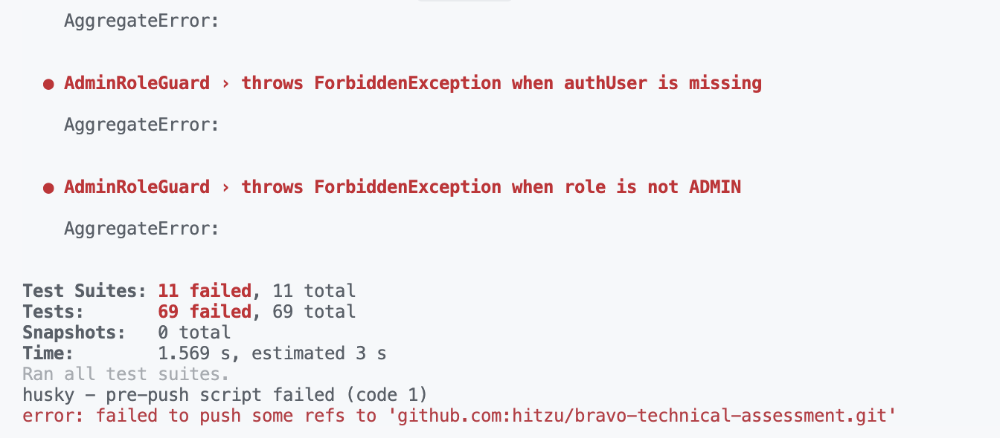
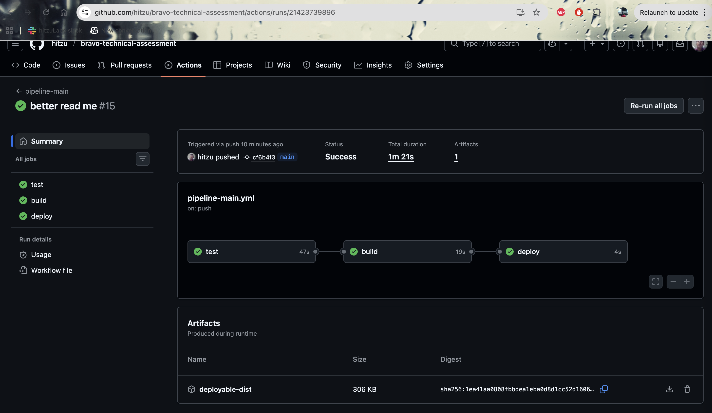

# CI/CD y flujo de desarrollo local

Este documento explica cómo está configurada la **integración continua (CI)** en GitHub Actions y cómo se espera que el flujo de desarrollo local funcione usando **Husky** para pre-commit hooks, con el objetivo de:

- Evitar “quemar” créditos de CI en errores triviales.
- Asegurar que lo que pasa en CI es lo mismo que se valida en local.
- Dejar claro al revisor qué garantías ofrece el pipeline actual.

---

## 1. Husky + pre-commit hooks (desarrollo local)

El repositorio incluye configuración de **Husky** para ejecutar checks antes de permitir un `git commit`.

### 1.1 Instalación (una sola vez)

Después de clonar el repo e instalar dependencias:

```bash
pnpm install
pnpm husky install
```

> Si al hacer commit ves un error tipo “husky: command not found”, revisa que `pnpm install` se haya ejecutado correctamente.

### 1.2 Qué corre el pre-commit

El hook de pre-commit (definido en `.husky/pre-commit`) ejecuta, por ejemplo:

- Tests rápidos de backend (`pnpm test` con filtros de unidades más importantes).
- Opcionalmente, checks de tipo (`pnpm lint` / `pnpm typecheck`) si se activan.

La intención es que:

- Los errores evidentes de lint o tests sencillos se detecten antes de subir código.
- Se reduzca el número de fallos triviales en GitHub Actions.

> Nota: los hooks están pensados para ser suficientemente rápidos como para no estorbar en el flujo diario. Validaciones más pesadas ocurren en CI.



---

## 2. GitHub Actions – Pipeline principal

El repo define un workflow principal en `.github/workflows/pipeline-main.yml` que se ejecuta en pushes y/o PRs hacia la rama principal.

### 2.1 Pasos del pipeline

A alto nivel, el job hace:

1. **Checkout** del repositorio.
2. Instala Node (v22) y pnpm.
3. **Instala dependencias** con `pnpm install`.
4. Levanta un servicio de **PostgreSQL** para los tests.
5. Ejecuta:
   - `pnpm build` (asegura que el código compila).
   - `pnpm test` (tests unitarios de backend).

La base de datos de test se configura mediante variables de entorno (`DB_HOST`, `DB_PORT`, `DB_NAME`, etc.). En el README se documenta cómo estas variables se reflejan en la configuración de TypeORM.

### 2.2 Estrategia de CI

El pipeline actual está pensado como **“gated build”**:

- Si el build o los tests fallan, la PR muestra el error de forma explícita.
- No se hace despliegue automático; el job de `deploy` está preparado como placeholder para un futuro pipeline real (por ejemplo, hacia Kubernetes).

Esto encaja bien con el contexto de prueba técnica: el evaluador puede ver rápidamente si el proyecto builda y si hay tests básicos cubriendo la lógica core.



---

## 3. Artefactos y reproducibilidad

El proyecto está diseñado para ser reproducible en local con:

```bash
docker compose -f docker-compose.demo.yml up --build
```

En CI se sigue una lógica similar:

- PostgreSQL se levanta en un servicio efímero.
- La app se compila y se testea contra esa DB de test.

Si en el futuro se necesitara empaquetar artefactos (por ejemplo, imágenes Docker), el workflow de CI se podría extender con:

- Un job que haga `docker build` para backend/frontend.
- Publicación de imágenes en un registry (GHCR, ECR, etc.).
- Uso de esos tags en manifiestos de Kubernetes.

Por ahora, esto se deja fuera del alcance del reto y se documenta como posible extensión.

---

## 4. Resumen rápido

- **Husky** se usa para pre-commit hooks y evitar enviar código roto a CI.
- **GitHub Actions** corre build + tests con una instancia de Postgres de test.
- El pipeline no despliega, pero está preparado para integrarse con un flujo de CD hacia Kubernetes o cualquier otra plataforma.
- La combinación _hooks locales + CI_ garantiza que el código que llega a main ya pasó por lint/test básicos tanto en local como en remoto.
