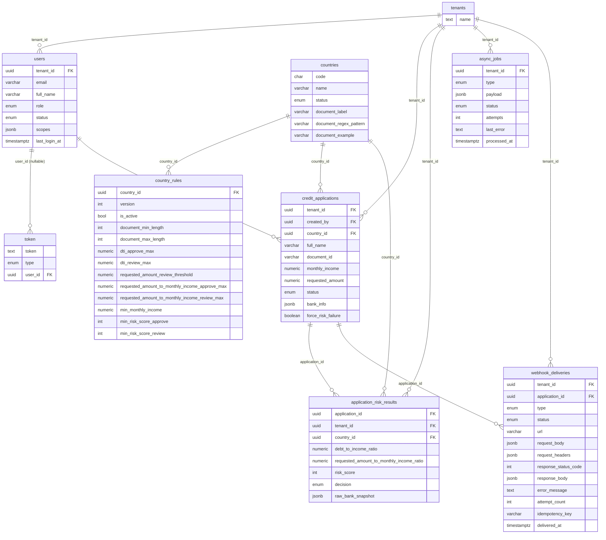

# Modelo de datos (PostgreSQL)

> Nota: **todas las tablas** incluyen las columnas comunes `id`, `created_at`, `updated_at` y `deleted_at` (soft-delete).  
> Para mejorar la lectura, **esas columnas se omiten** en el diagrama y en las definiciones de tablas de este documento.

---

## 1. Diagrama ER (Mermaid)

---

## 2. Conceptos clave del modelo

### 2.1 Multi-tenant (aislamiento por tenant)

- Las tablas "de negocio" llevan `tenant_id` obligatorio:  
  `users`, `credit_applications`, `application_risk_results`, `async_jobs`, `webhook_deliveries`.
- En tiempo de ejecución, el backend extrae el `tenantId` del token de demo  
  (`DEV.v1.<tenantId>.<userId>.<role>.<timestamp>`) y lo usa para:
  - Filtrar todas las consultas de negocio.
  - Evitar que un usuario de un tenant vea/modifique datos de otro tenant.

### 2.2 Procesamiento asíncrono (cola en Postgres)

- Al crear una solicitud en `credit_applications`, un **trigger en DB** encola un job `RISK_EVAL` en `async_jobs`.
- El worker toma jobs `PENDING` usando `FOR UPDATE SKIP LOCKED`, lo que permite **paralelizar workers** sin colisiones.
- Flujo típico de estados de un job:
  - `PENDING → RUNNING → DONE`
  - `PENDING → RUNNING → PENDING` (reintento con `last_error`)
  - `PENDING → RUNNING → DLQ` (fallo definitivo o input inválido)

### 2.3 Evaluación de riesgo (historial por solicitud)

- Cada evaluación escribe un registro en `application_risk_results`.
- Una misma solicitud (`credit_applications`) puede tener **múltiples resultados** (primer cálculo, reevaluaciones, cambios de reglas).
- El frontend obtiene y muestra el **último resultado** (ordenado por `created_at DESC`).

### 2.4 Integración externa (webhooks)

- `webhook_deliveries` registra intentos de entrega hacia/desde un proveedor externo (mock en este MVP):
  - Cuerpo de la request, headers, URL.
  - Respuesta HTTP (código + body) si existió.
  - Mensaje de error si falló.
  - Contador de intentos e idempotency key (cuando aplique).
- Esto permite depurar:
  - Qué se intentó enviar.
  - Qué respondió el partner (o si nunca respondió).
  - Cuántos intentos se hicieron por cada solicitud.

---

## 3. Tablas (detalle)

> En todas las tablas se asume `id uuid PRIMARY KEY` y columnas de auditoría (`created_at`, `updated_at`, `deleted_at`).  
> Aquí se documentan únicamente las columnas específicas de cada dominio.

### 3.1 `tenants`

Tenants (clientes/productos de Bravo) del sistema.  
Es la raíz del aislamiento multi-tenant.

| Columna | Tipo   | Descripción                                                     |
| ------- | ------ | --------------------------------------------------------------- |
| `name`  | `text` | Nombre del tenant (p.ej. "Reparadora de crédito", "Préstamos"). |

**Notas**

- Muchas tablas referencian `tenants` vía `tenant_id`.
- La aplicación asume que un usuario pertenece a exactamente un tenant.

---

### 3.2 `users`

Operadores del sistema. Un usuario pertenece a un tenant y tiene un rol lógico (ADMIN/AGENT).

| Columna         | Tipo          | Descripción                                            |
| --------------- | ------------- | ------------------------------------------------------ |
| `tenant_id`     | `uuid`        | FK → `tenants.id`.                                     |
| `email`         | `varchar`     | Email del operador (único por tenant).                 |
| `full_name`     | `varchar`     | Nombre completo.                                       |
| `role`          | `enum`        | Rol (`ADMIN` / `AGENT`).                               |
| `status`        | `enum`        | Estado del usuario (p.ej. activo/inactivo/suspendido). |
| `scopes`        | `jsonb`       | Permisos/alcances extra (si algún día se amplía RBAC). |
| `last_login_at` | `timestamptz` | Último login exitoso.                                  |

**Notas**

- Restricción esperada: email único por tenant → `ux_users_tenant_email (tenant_id, email)`.
- En RBAC actual:
  - `ADMIN` ve todas las solicitudes del tenant.
  - `AGENT` sólo ve sus solicitudes (`credit_applications.created_by`).

---

### 3.3 `token`

Store de tokens de demo. Permite **revocar** tokens marcándolos como borrados (soft-delete).

| Columna   | Tipo   | Descripción                                                          |
| --------- | ------ | -------------------------------------------------------------------- |
| `token`   | `text` | Token dev (formato `DEV.v1.{tenantId}.{userId}.{role}.{timestamp}`). |
| `type`    | `enum` | Tipo de token (por ahora sólo dev).                                  |
| `user_id` | `uuid` | FK → `users.id` (**nullable**).                                      |

**Notas**

- El guard de auth:
  - Parsea el token (saca tenantId, userId, role).
  - Verifica que el token **exista** en esta tabla y no esté soft-deleted.
- `user_id` es nullable para permitir, si se quisiera, tokens "huérfanos".
  En el flujo actual siempre se asocia a un usuario.

---

### 3.4 `countries`

Catálogo de países soportados, con metadata para validar el documento de identidad.

| Columna                  | Tipo      | Descripción                                                  |
| ------------------------ | --------- | ------------------------------------------------------------ |
| `code`                   | `char`    | Código del país (p.ej. `ES`, `MX`, `PT`).                    |
| `name`                   | `varchar` | Nombre del país.                                             |
| `status`                 | `enum`    | Estado (`ACTIVE` / `INACTIVE`).                              |
| `document_label`         | `varchar` | Etiqueta del documento para UI (p.ej. "DNI", "CURP", "RFC"). |
| `document_regex_pattern` | `varchar` | Regex (texto) para validar `document_id` del cliente.        |
| `document_example`       | `varchar` | Ejemplo de valor válido para mostrar en la UI.               |

**Notas**

- Se usa en la UI para poblar dropdown de países.
- Se combina con `country_rules` para determinar reglas de riesgo.

---

### 3.5 `country_rules`

"Knobs" configurables por país para ajustar las reglas de evaluación de riesgo **sin cambiar código**.  
Permite versionar reglas y activar una sola versión por país.

| Columna                                          | Tipo      | Descripción                                                                 |
| ------------------------------------------------ | --------- | --------------------------------------------------------------------------- |
| `country_id`                                     | `uuid`    | FK → `countries.id`.                                                        |
| `version`                                        | `int`     | Versión de regla para ese país.                                             |
| `is_active`                                      | `bool`    | Indica si esta versión está activa.                                         |
| `document_min_length`                            | `int`     | Longitud mínima del documento.                                              |
| `document_max_length`                            | `int`     | Longitud máxima del documento.                                              |
| `dti_approve_max`                                | `numeric` | DTI máximo para decidir `APPROVE`.                                          |
| `dti_review_max`                                 | `numeric` | DTI máximo para decidir `REVIEW`.                                           |
| `requested_amount_review_threshold`              | `numeric` | Umbral de monto a partir del cual forzar `REVIEW` (en algunas estrategias). |
| `requested_amount_to_monthly_income_approve_max` | `numeric` | Máximo ratio monto/ingreso para `APPROVE`.                                  |
| `requested_amount_to_monthly_income_review_max`  | `numeric` | Máximo ratio monto/ingreso para `REVIEW`.                                   |
| `min_monthly_income`                             | `numeric` | Ingreso mensual mínimo aceptado por país.                                   |
| `min_risk_score_approve`                         | `int`     | Score mínimo para poder `APPROVE`.                                          |
| `min_risk_score_review`                          | `int`     | Score mínimo para poder `REVIEW`.                                           |

**Notas**

- Restricción de unicidad: `ux_country_rules_country_version (country_id, version)`.
- Índice para la regla activa: `ix_country_rules_country_active (country_id, is_active)`.
- El motor de riesgo lee **la regla activa** para el país de la solicitud y aplica los knobs sobre la estrategia.

---

### 3.6 `credit_applications`

Solicitud de crédito. Es el núcleo funcional: desde aquí se dispara evaluación de riesgo y se consultan los resultados.

| Columna              | Tipo      | Descripción                                                                             |
| -------------------- | --------- | --------------------------------------------------------------------------------------- |
| `tenant_id`          | `uuid`    | FK → `tenants.id`.                                                                      |
| `created_by`         | `uuid`    | FK → `users.id` (quién creó la solicitud).                                              |
| `country_id`         | `uuid`    | FK → `countries.id`.                                                                    |
| `full_name`          | `varchar` | Nombre completo del solicitante.                                                        |
| `document_id`        | `varchar` | Documento de identidad (validado según `countries.document_regex_pattern` / reglas).    |
| `monthly_income`     | `numeric` | Ingreso mensual declarado por el solicitante.                                           |
| `requested_amount`   | `numeric` | Monto solicitado.                                                                       |
| `status`             | `enum`    | Estado de la solicitud (`PENDING`, `IN_REVIEW`, `APPROVED`, `REJECTED`, `ERROR`, etc.). |
| `bank_info`          | `jsonb`   | Campo reservado para información bancaria complementaria (no crítico en el MVP).        |
| `force_risk_failure` | `boolean` | Flag de demo para forzar fallo de riesgo y enviar el job a `DLQ`.                       |

**Notas**

- Índices sugeridos para listados:  
  `ix_credit_applications_tenant_status_created_at (tenant_id, status, created_at)`.
- La evaluación de riesgo no sobreescribe `requested_amount` ni `monthly_income`; opera sobre estos valores más el snapshot bancario.

---

### 3.7 `application_risk_results`

Resultados de evaluación de riesgo por solicitud.  
Mantiene trazabilidad del cálculo, decision y datos del "proveedor bancario" (mock).

| Columna                                    | Tipo      | Descripción                                         |
| ------------------------------------------ | --------- | --------------------------------------------------- |
| `application_id`                           | `uuid`    | FK → `credit_applications.id`.                      |
| `tenant_id`                                | `uuid`    | FK → `tenants.id`.                                  |
| `country_id`                               | `uuid`    | FK → `countries.id`.                                |
| `debt_to_income_ratio`                     | `numeric` | DTI calculado (`totalDebt / bankMonthlyIncome`).    |
| `requested_amount_to_monthly_income_ratio` | `numeric` | Ratio `requestedAmount / bankMonthlyIncome`.        |
| `risk_score`                               | `int`     | Score numérico de riesgo (función de DTI y reglas). |
| `decision`                                 | `enum`    | Decisión (`APPROVE`, `REVIEW`, `REJECT`).           |
| `raw_bank_snapshot`                        | `jsonb`   | Snapshot bancario (mock) usado para el cálculo.     |

**Notas**

- Una solicitud puede tener múltiples registros (p.ej. reevaluaciones).
- El detalle de la solicitud muestra el **último** resultado por `(tenant_id, application_id, created_at DESC)`.

---

### 3.8 `async_jobs`

Cola de trabajo asíncrono respaldada en Postgres.  
En este MVP, maneja trabajos de tipo `RISK_EVAL` creados automáticamente al insertar en `credit_applications`.

| Columna        | Tipo          | Descripción                                               |
| -------------- | ------------- | --------------------------------------------------------- |
| `tenant_id`    | `uuid`        | FK → `tenants.id`.                                        |
| `type`         | `enum`        | Tipo de job (p.ej. `RISK_EVAL`).                          |
| `payload`      | `jsonb`       | Datos necesarios para el job (p.ej. `{ applicationId }`). |
| `status`       | `enum`        | Estado del job (`PENDING`, `RUNNING`, `DONE`, `DLQ`).     |
| `attempts`     | `int`         | Número de intentos realizados.                            |
| `last_error`   | `text`        | Último mensaje de error, si falló.                        |
| `processed_at` | `timestamptz` | Momento de procesamiento exitoso (si aplica).             |

**Notas**

- Selección de jobs para procesamiento: `WHERE status = 'PENDING' ORDER BY created_at ASC FOR UPDATE SKIP LOCKED LIMIT N`.
- Idealmente indexado por `(status, created_at)` para minimizar contención.

---

### 3.9 `webhook_deliveries`

Registro de intentos de webhook relacionados con solicitudes de crédito.  
Permite auditar y depurar integraciones externas (incluso en este MVP donde el proveedor es mock).

| Columna                | Tipo          | Descripción                                                                    |
| ---------------------- | ------------- | ------------------------------------------------------------------------------ |
| `tenant_id`            | `uuid`        | FK → `tenants.id`.                                                             |
| `application_id`       | `uuid`        | FK → `credit_applications.id`.                                                 |
| `type`                 | `enum`        | Tipo de webhook (p.ej. `APPLICATION_RISK_UPDATED`).                            |
| `status`               | `enum`        | Estado (`PENDING`, `SENT`, `SUCCESS`, `FAILED`).                               |
| `url`                  | `varchar`     | URL destino a la que se hizo el POST.                                          |
| `request_body`         | `jsonb`       | Cuerpo JSON enviado.                                                           |
| `request_headers`      | `jsonb`       | Headers enviados (p.ej. idempotency key).                                      |
| `response_status_code` | `int`         | Código HTTP devuelto por el partner.                                           |
| `response_body`        | `jsonb`       | Cuerpo de respuesta (si existió).                                              |
| `error_message`        | `text`        | Mensaje de error interno si la llamada falló antes de tener respuesta.         |
| `attempt_count`        | `int`         | Número total de intentos hechos para este delivery.                            |
| `idempotency_key`      | `varchar`     | Clave de idempotencia lógica (para evitar procesar el mismo evento dos veces). |
| `delivered_at`         | `timestamptz` | Momento de entrega exitosa (si aplica).                                        |

**Notas**

- Útil para demos: se puede mostrar en el frontend/Swagger cómo luce un delivery exitoso vs. uno fallido.
- También sirve como base para procesos de **reconciliación** en futuros desarrollos (replay de eventos, reintentos manuales, etc.).
